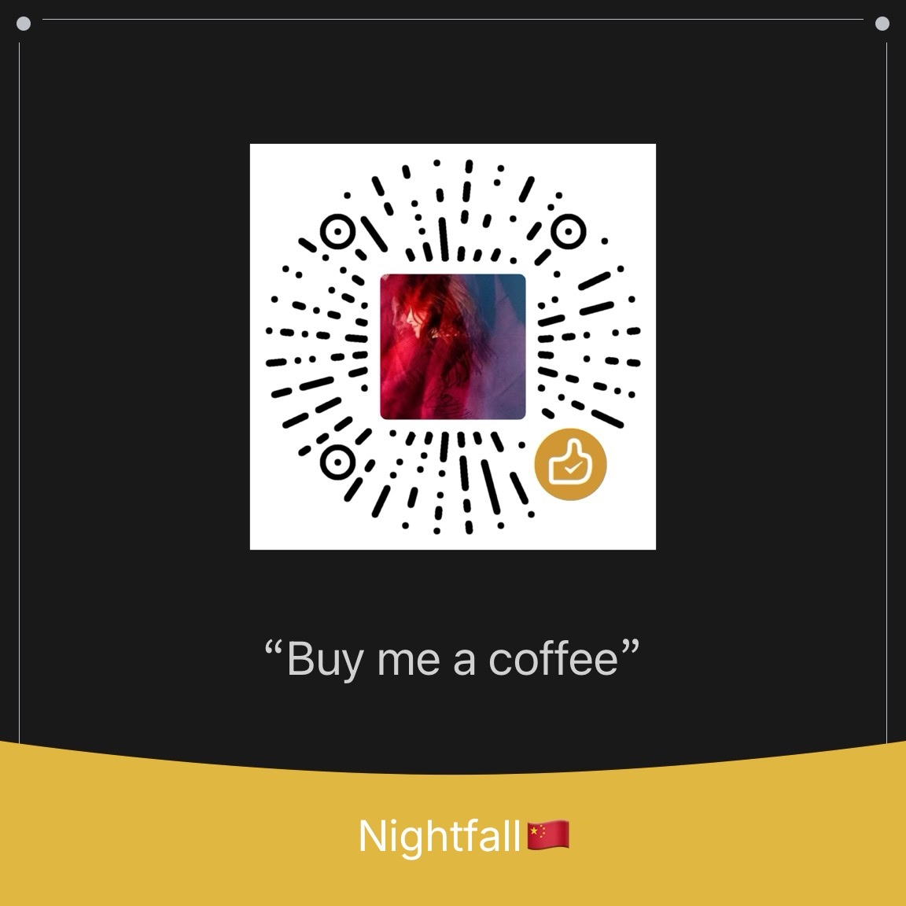

# Obsidian Third-party Sync

[Remotely Save](https://github.com/remotely-save/remotely-save)에서 포크한 Obsidian 동기화 플러그인입니다. **보안 강화**를 최우선으로, 암호화 레이어를 AES-256-GCM으로 재구축하고 코드베이스를 간소화했습니다. **Remotely Save와 하위 호환되지 않습니다** — 전환 전에 반드시 Vault를 백업하세요.

 |  | 

[English](README.md) | [简体中文](README_zh-CN.md) | [繁體中文](README_zh-TW.md) | [日本語](README_ja.md) | 한국어 | [Deutsch](README_de.md) | [Français](README_fr.md) | [Español](README_es.md) | [Italiano](README_it.md) | [Nederlands](README_nl.md) | [Dansk](README_da.md) | [Svenska](README_sv.md) | [Norsk](README_no.md) | [Русский](README_ru.md)

## 면책 조항

- **Obsidian에서 공식적으로 제공하는 [동기화 서비스](https://obsidian.md/sync)가 아닙니다.**
- **⚠️ 사용 전 반드시 Vault를 백업하세요.**

## 왜 Remotely Save에서 포크했나요?

### 보안 강화 (주요 개선 사항)

- **암호화 알고리즘**
  - Remotely Save: AES-CBC 또는 AES-CTR (RClone)
  - 이 플러그인: **AES-256-GCM**
- **무결성 검증**
  - Remotely Save: 없음 (CBC 모드는 padding oracle 공격에 취약)
  - 이 플러그인: **GCM 내장 AuthTag 검증**
- **초기화 벡터 (IV)**
  - Remotely Save: 암호에서 파생 (동일 암호의 모든 파일이 동일 IV 사용)
  - 이 플러그인: **파일마다 무작위 생성**
- **Salt 길이**
  - Remotely Save: 8바이트 (2^64 가지 가능성)
  - 이 플러그인: **16바이트** (2^128 가지 가능성)
- **암호화 의존성**
  - Remotely Save: `crypto-browserify` + `@fyears/rclone-crypt` + Web Worker
  - 이 플러그인: **브라우저 네이티브 `window.crypto.subtle` API**

### 아키텍처 간소화

원본에 비해 다음과 같이 간소화했습니다:

- **스토리지 서비스**: 13개에서 3개의 주류 서비스(S3 / WebDAV / OneDrive)로 축소. Dropbox, Google Drive, Box, Azure Blob, pCloud, Yandex Disk, Koofr, Webdis 등 제거.
- **암호화 방식**: 2개(OpenSSL + RClone)에서 1개(**AES-256-GCM**)로 통합.

## 주요 기능

- **지원 스토리지**: Amazon S3(및 호환 서비스: 텐센트 COS, 알리바바 OSS, Backblaze B2, MinIO 등), WebDAV(坚果云/Nutstore, Nextcloud, OwnCloud, Seafile, rclone 등), OneDrive 개인용. 자세한 내용은 [지원 서비스 목록](./docs/services_connectable_or_not.md)을 참조하세요.
- **종단 간 암호화** ([자세히](./docs/encryption.md)): 암호를 설정하면 파일은 업로드 전에 **AES-256-GCM(브라우저 네이티브 Web Crypto API)**으로 로컬 암호화되며, RClone Crypt의 base64url 파일명 인코딩과 호환됩니다.
- **자동 동기화**: 정기 실행, 시작 시, 저장 시, 원격 변경 감지 시 동기화 지원.
- **동기화 방향**: 양방향 / 증분 푸시(백업 모드) / 증분 풀 / 삭제를 포함한 증분 모드.
- **변경 비율 보호**: 변경·삭제 파일 비율이 임계값을 초과하면 동기화를 중단하여 실수로 인한 데이터 손실을 방지.
- **충돌 처리**: 충돌 시 더 새 버전을 유지할지 더 큰 파일을 유지할지 구성 가능.
- **큰 파일 건너뛰기**: 설정된 크기를 초과하는 파일을 건너뜀.
- **북마크 및 설정 디렉터리 동기화** (선택 사항).
- **상태 표시줄**: 동기화 진행 상황과 마지막 동기화 시간을 표시.
- **모바일 지원**: Obsidian 모바일(Android / iOS)에서도 종단 간 암호화를 포함한 모든 기능 사용 가능.
- **설정의 URI 가져오기/내보내기** (OneDrive OAuth 정보 제외).
- **빈 디렉터리 정리**: 동기화 후 비어있는 디렉터리를 자동 삭제.
- **[최소 침습적 디자인](./docs/minimal_intrusive_design.md)**.
- **완전 오픈 소스** ([Apache-2.0](./LICENSE)).
- **[동기화 알고리즘](./docs/sync_algorithm.md)**.
- **🌐 다국어 지원** — UI는 Obsidian 표시 언어를 자동으로 따름(총 14개 언어: English、简体中文、繁體中文、日本語、한국어、Deutsch、Français、Español、Italiano、Nederlands、Dansk、Svenska、Norsk、Русский). 수동 설정 불필요, 번역이 없으면 영어로 폴백.

## 제한 사항 및 주의사항

- **메타데이터 동기화 없음 — 삭제 감지는 타임스탬프 비교에 의존**합니다. 증분 푸시/풀 모드 사용을 권장합니다.
- **단순 충돌 해결**: 파일은 수정 시각으로 비교하며 더 새 버전이 우선합니다.
- **클라우드 서비스는 비용이 발생합니다**: 업로드, 다운로드, 파일 목록, API 호출 등 모든 작업에 비용이 부과될 수 있습니다.
- **일부 제한 사항은 브라우저 환경에서 비롯됩니다**. 자세한 내용은 [기술 문서](./docs/browser_env.md)를 참조하세요.
- **`data.json` 파일을 보호하세요**: S3 키, WebDAV 비밀번호 등 민감한 정보가 포함됩니다. 다른 사람과 공유하지 말고 `.gitignore`에 추가하는 것을 권장합니다.

## 설치

**방법 1**: Obsidian 커뮤니티 플러그인 마켓에서 `Obsidian Third-party Sync`를 검색하여 설치.

**방법 2**: [Obsidian42 - BRAT](https://github.com/TfTHacker/obsidian42-brat)를 사용하여 리포지토리 `nightfall-yl/obsidian-third-party-sync` 추가.

**방법 3**: 최신 릴리스에서 `main.js`, `manifest.json`, `styles.css`를 수동으로 다운로드하여 Vault의 `.obsidian/plugins/third-party-sync/` 디렉터리에 배치.

## 사용 방법

### S3

- S3 정보 준비: Endpoint, Region, Access Key ID, Secret Access Key, Bucket 이름.
- 플러그인 설정에 입력하고 암호화 암호를 설정(필요한 경우).
- 리본 아이콘을 클릭하여 수동으로 동기화하거나, 설정에서 자동 동기화를 활성화.

### WebDAV

- 坚果云/Nutstore, Nextcloud, OwnCloud, Seafile, rclone 등 지원.
- 일부 서비스에는 `WebAppPassword` 등의 플러그인이 필요할 수 있습니다. 자세한 내용은 [WebDAV 설정 문서](./docs/apache_cors_configure.md)를 참조하세요.

### OneDrive (개인용)

- 개인 계정만 지원 — OneDrive for Business는 지원하지 않음.
- 인증 후 플러그인은 `/Apps/third-party-sync/` 아래에서 읽고 씁니다.
- 종단 간 암호화 지원(Vault 이름 자체는 암호화되지 않음).

### 자동 동기화

- 자동 동기화 모드에서 오류는 조용히 실패합니다.
- Obsidian이 닫혀 있는 동안은 실행할 수 없습니다(브라우저 플러그인의 기술적 한계).

### 숨겨진 파일

- `.` 또는 `_`로 시작하는 파일/디렉터리는 기본적으로 동기화 대상 제외.
- 설정에서 `_` 디렉터리와 `.obsidian` 설정 디렉터리의 동기화를 활성화할 수 있습니다.

## 커피 한 잔

이 플러그인이 도움이 되었다면 작성자에게 커피 한 잔 사주세요 ☕️

## 크레딧

- 원본 [Remotely Save](https://github.com/remotely-save/remotely-save) 프로젝트의 @fyears에게 감사드립니다.

## 피드백

[GitHub Issues](https://github.com/nightfall-yl/obsidian-third-party-sync/issues)에 이슈를 열어주세요. 풀 리퀘스트도 환영합니다!
