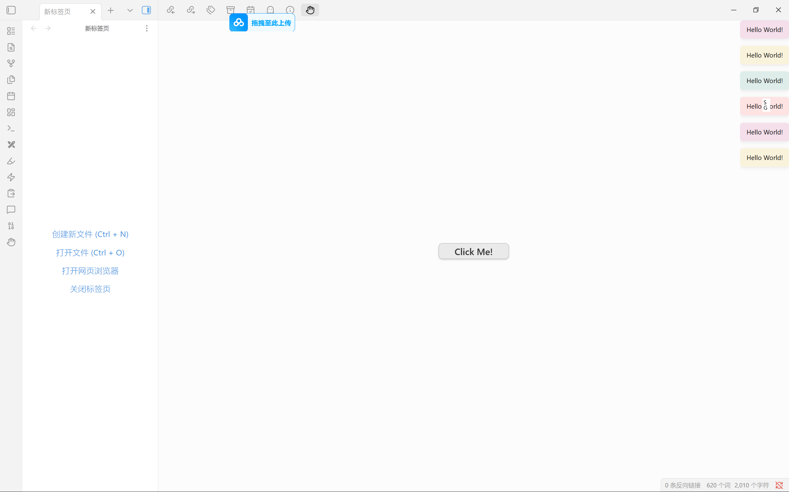

# Obsidian Plugin Dev Skill

[English](README.md) | **[中文](README_zh-CN.md)**

Obsidian 插件开发 Skill，适用于 Claude Code 或 Codex。提供完整的 API 参考、项目模板和最佳实践，帮助你从零开始构建 Obsidian 插件。



> 上方截图展示了使用本 Skill 通过一句话指令创建的插件：一个交互式按钮，点击后显示 "Hello World!"。

## 这是什么？

这是一个开发 Skill，也就是编码 Agent 按需加载的知识包。安装后，当你向 Claude Code 或 Codex 提出任何关于 Obsidian 插件开发的问题，它会自动激活本 Skill，获得以下能力：

- 完整的 Obsidian TypeScript API 参考（66 个类、92 个接口、56 个函数）
- 3 套开箱即用的项目模板（简单命令 / 自定义视图 / 编辑器扩展）
- 9 种 UI 组件完整代码模式（命令、模态框、设置面板、视图、菜单等）
- CodeMirror 6 编辑器扩展开发指南
- React / Svelte / Vue 框架集成方案
- 发布审核合规清单 + GitHub Actions 自动发布工作流
- 调试技巧与常见问题排查

## 安装

将整个目录复制到 Agent 的 skills 文件夹：

```bash
# 克隆仓库
git clone https://github.com/Szturin/obsidian-plugin-dev-skill.git

# 复制到 Codex skills 目录
# Windows PowerShell
xcopy /E /I obsidian-plugin-dev-skill "%USERPROFILE%\.codex\skills\obsidian-plugin-dev"

# macOS / Linux
cp -r obsidian-plugin-dev-skill ~/.codex/skills/obsidian-plugin-dev

# 如需用于 Claude Code，也可复制到 Claude Code skills 目录
# Windows PowerShell
xcopy /E /I obsidian-plugin-dev-skill "%USERPROFILE%\.claude\skills\obsidian-plugin-dev"

# macOS / Linux
cp -r obsidian-plugin-dev-skill ~/.claude/skills/obsidian-plugin-dev
```

或手动下载文件放置到：

```
~/.codex/skills/obsidian-plugin-dev/
# 或
~/.claude/skills/obsidian-plugin-dev/
```

重启你的 Agent 应用，Skill 会被自动检测到。

## 使用方法

安装后，直接用自然语言和 Claude Code 对话即可：

```
> 创建一个在状态栏显示字数统计的 Obsidian 插件
> 做一个带侧边栏视图的插件，列出所有 TODO 项
> 添加一个命令，把选中文本包裹在 callout 块中
> 创建一个编辑器扩展，高亮行内代码
```

编码 Agent 会自动选择合适的模板、应用最佳实践，生成可直接使用的代码。

### 项目模板

| 模板 | 适用场景 | 文件 |
|------|----------|------|
| `template-simple` | 命令、功能区图标、设置、文本处理 | main.ts + 配置文件 |
| `template-view` | 侧边栏面板、数据展示、列表管理 | main.ts + view.ts + settings.ts + 配置文件 |
| `template-editor-extension` | CM6 装饰、语法高亮、实时预览修改 | main.ts + extension.ts + widget.ts + 配置文件 |

### 快速初始化（PowerShell）

```powershell
& "$env:USERPROFILE\.codex\skills\obsidian-plugin-dev\scripts\init-obsidian-plugin.ps1" `
  -Name "my-plugin" -Template "simple" -VaultPath "D:\MyVault"
```

### 快速初始化（macOS / Linux）

```bash
~/.codex/skills/obsidian-plugin-dev/scripts/init-obsidian-plugin.sh \
  --name my-plugin --template simple --vault-path "$HOME/Documents/MyVault"
```

## 文件结构

```
obsidian-plugin-dev/
├── SKILL.md                              # 主文档（Skill 入口）
├── references/
│   ├── api-quick-reference.md            # 核心 API 速查表
│   ├── ui-patterns.md                    # 9 种 UI 组件完整代码模式
│   ├── editor-extensions.md              # CM6 扩展指南 (StateField/ViewPlugin/Decoration)
│   ├── framework-integration.md          # React / Svelte / Vue 集成方案
│   ├── publishing-checklist.md           # 发布审核合规清单
│   └── troubleshooting.md               # 调试技巧与常见问题
├── scripts/
│   ├── init-obsidian-plugin.ps1          # Windows 项目初始化脚本
│   └── init-obsidian-plugin.sh           # macOS / Linux 项目初始化脚本
└── assets/
    ├── template-simple/                  # 简单插件（命令 + 设置）
    ├── template-view/                    # 视图插件（侧边栏 + 设置）
    ├── template-editor-extension/        # 编辑器扩展（CM6 装饰）
    ├── github-release.yml                # GitHub Actions 发布工作流
    └── images/                           # 演示截图
```

## 知识来源

本 Skill 从 [Obsidian 插件开发中文文档](https://github.com/luhaifeng666/obsidian-plugin-docs-zh) 项目的 253 篇 Markdown 文档中提炼而成，原文档由 [@marcusolsson](https://github.com/marcusolsson) 及 Obsidian 社区编写。

官方文档已迁移至 [docs.obsidian.md](https://docs.obsidian.md/Home)。

## 环境要求

- Claude Code 或 Codex
- Node.js 16+（用于构建插件）
- npm 或 yarn

## 开源协议

MIT
